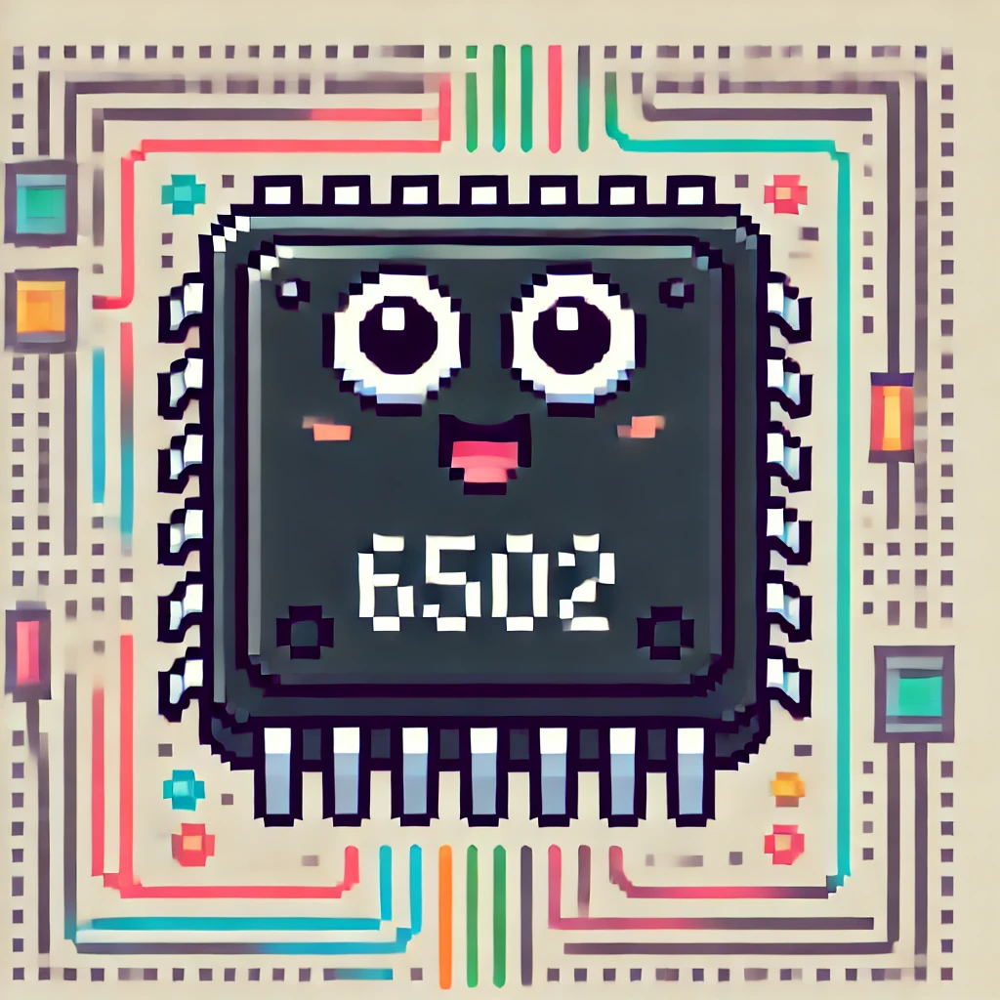

# Q6502

---



---

## PRESENTATION

A 6502 cpu emulator. This has all addressing mode, legal & illegal opcodes implemented.

comprises of:
 - Motherboard *this manages memory read and write functions, brings up all the modules together and runs eveyrthing*
 - Clock *Crystal oscillator emulator to emulate the 1,79MHz frquency of the 6502*
 - CPU *6502 emulator*
 - Memory *So far the board has access to 2x32KB arrays to represent RAM and ROM*
 - Debug Tools *Prints the internal CPU state and throws exceptions*

This serves as a boilerplate for building 6502-based computers and consoles (C64, Apple II, NES...) or even your own custom machine.

**THIS MIGHT BE BUGGY** So far, all issue I have encountered were from programs I was making not the CPU itself.

Do not hesitate to share any improvments you make to this code or anything you build with it.

---

## PREREQUISITES

* C11 compiler
* Make (not a lot of source files so you can compile directly on the CLI, but make is just easier)

---

## SUPPORTED PLATFORMS

- [X] Windows
- [X] Linux
- [X] macOS

---

## HOW TO USE

```sh
git clone https://github.com/itsjustgalileo/q6502.git

cd q6502

make

# if no rom is provided a system loads a default ROM with a reset routine and a loop.
./emulator <ROM_FILE_PATH>
```

---

## REFERENCES

* [NesDev Wiki](https://www.nesdev.org/wiki/NES_reference_guide)
* [6502 inner workings](https://www.masswerk.at/6502/6502_instruction_set.html)
* [NES general info](https://www.copetti.org/writings/consoles/nes/)

---

## TODO

- [ ] RAM
- [ ] I/O
- [ ] VRAM
- [ ] AUDIO
- [ ] BANKS
- [ ] BIOS
- [ ] BASIC
